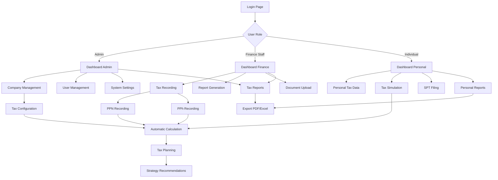

## 1. Product Overview

Sistem Tax Planning & Pencatatan Pajak adalah aplikasi web yang dirancang untuk membantu perusahaan dan individu mengelola kewajiban perpajakan secara efisien. Aplikasi ini menyediakan fitur lengkap untuk pencatatan transaksi pajak, perhitungan otomatis, perencanaan pajak, dan pelaporan sesuai dengan peraturan perpajakan Indonesia.

Produk ini membantu pengguna mengatasi kompleksitas perhitungan pajak, mengurangi risiko kesalahan, memastikan kepatuhan terhadap deadline, serta mengoptimalkan strategi perpajakan melalui fitur simulasi dan planning yang terintegrasi.

Target pasar: Wajib Pajak Badan (perusahaan), Wajib Pajak Orang Pribadi, konsultan pajak, dan akuntan yang membutuhkan solusi terpadu untuk manajemen pajak.

## 2. Core Features

### 2.1 User Roles

| Role                | Registration Method   | Core Permissions                                              |
| ------------------- | --------------------- | ------------------------------------------------------------- |
| Admin               | Email registration    | Full access to all features, user management, system settings |
| Finance Staff       | Invitation from admin | Manage tax recording, generate reports, view company data     |
| Auditor             | Invitation from admin | View-only access to reports and tax data, audit trail         |
| Individual Taxpayer | Email registration    | Access personal tax features only                             |

### 2.2 Feature Module

Aplikasi Tax Planning & Pencatatan Pajak terdiri dari halaman-halaman utama berikut:

1. **Dashboard Pajak**: Ringkasan pajak, total terutang, status pembayaran, deadline, notifikasi tunggakan.
2. **Manajemen Perusahaan**: Daftar perusahaan, profil pajak, NPWP, status PKP, jenis usaha.
3. **Pajak Pribadi**: NPWP pribadi, aset, penghasilan, pengeluaran yang dapat dikurangkan.
4. **Pencatatan Pajak**: PPN (masukan/keluaran), PPh Badan (21/22/23/25/Final), PPh Pribadi.
5. **Rumus Pajak**: Library rumus perhitungan PPN, PPh 21, PPh 23/26, PPh Final UMKM, PPh Badan.
6. **Catatan & Arsip Pajak**: Catatan khusus, koreksi fiskal, upload dokumen (faktur, bukti setor, SPT).
7. **Tax Planner & Simulator**: Simulasi pajak perusahaan & pribadi, strategi penghematan pajak.
8. **Laporan Pajak**: Laporan PPN bulanan, PPh masa, rekonsiliasi pajak vs pembukuan, draft SPT.
9. **Pengingat & Notifikasi**: Deadline PPN, PPh Masa, SPT Tahunan, notifikasi denda keterlambatan.
10. **Pengaturan Sistem**: Manajemen user, role-based access, backup data, export Excel/PDF.

### 2.3 Page Details

| Page Name              | Module Name            | Feature description                                                                                                                                                                   |
| ---------------------- | ---------------------- | ------------------------------------------------------------------------------------------------------------------------------------------------------------------------------------- |
| Dashboard Pajak        | Ringkasan Pajak        | Menampilkan total pajak terutang bulan ini, pajak sudah dibayar, tagihan jatuh tempo, perusahaan dengan pajak terbesar dalam kartu-kartu ringkasan.                                   |
| Dashboard Pajak        | Grafik Pajak           | Menampilkan grafik batang/line pajak per bulan (PPN, PPh 21, PPh 23, PPh Badan) untuk visualisasi tren pajak.                                                                         |
| Dashboard Pajak        | Tabel Perusahaan       | Menampilkan tabel dengan kolom Perusahaan, Jenis Pajak, Periode, Terutang, Dibayar, Status untuk monitoring detail.                                                                   |
| Manajemen Perusahaan   | Daftar Perusahaan      | Menampilkan tabel perusahaan dengan kolom Nama, NPWP, Status PKP, Jenis Usaha, Jenis Pajak Aktif, tombol Detail/Edit.                                                                 |
| Manajemen Perusahaan   | Tambah Perusahaan      | Form untuk menambah perusahaan baru dengan field nama, NPWP, status PKP, jenis usaha/KLU, pengaturan SPT.                                                                             |
| Manajemen Perusahaan   | Detail Perusahaan      | Halaman detail menampilkan profil pajak, setting SPT (masa/tahunan), checklist jenis pajak yang berlaku.                                                                              |
| Pajak Pribadi          | Ringkasan Pribadi      | Kartu ringkasan menampilkan total penghasilan tahun berjalan, perkiraan pajak terutang, pajak sudah dipotong pihak lain.                                                              |
| Pajak Pribadi          | Data Penghasilan       | Tabel penghasilan dengan kolom Tanggal, Sumber (gaji/dividen/fee), Bruto, Pajak Dipotong, tombol tambah/edit.                                                                         |
| Pajak Pribadi          | PTKP & Pengurang       | Form untuk memilih status PTKP (TK/0, K/1, dll) dan input pengurang seperti iuran pensiun.                                                                                            |
| Pajak Pribadi          | Simulasi Pajak         | Tombol hitung PPh tahunan dengan output panel kanan menampilkan Penghasilan Neto, PKP, Pajak Terutang, Kredit Pajak, Kurang/Lebih Bayar.                                              |
| Pencatatan Pajak       | Tab PPN                | Filter perusahaan & periode, kartu Pajak Masukan total, kartu Pajak Keluaran total, selisih untuk setor PPN, tabel faktur masukan/keluaran.                                           |
| Pencatatan Pajak       | Tab PPh Badan          | Tabel PPh 21, 23, 25 per masa dengan kolom Jenis Pajak, Masa, Dasar Pengenaan, Tarif, Pajak Terutang, Dibayar, Bukti Setor.                                                           |
| Pencatatan Pajak       | Tab PPh Pribadi        | Tabel untuk pencatatan bukti potong dan setoran pajak pribadi dengan form input transaksi.                                                                                            |
| Rumus Pajak            | Library Formula        | Sidebar navigasi (PPN, PPh 21, PPh 23/26, PPh Final UMKM, PPh Badan,Prive, Dividen) dan panel konten dengan kartu rumus berisi judul, deskripsi, rumus matematis, contoh perhitungan. |
| Catatan & Arsip        | Catatan Perusahaan     | Form untuk menambah catatan khusus per transaksi, catatan koreksi fiskal, catatan audit internal dengan timestamp.                                                                    |
| Catatan & Arsip        | Upload Dokumen         | Fitur upload dan preview dokumen: faktur pajak, bukti setor, bukti potong, SPT masa, SPT tahunan dengan kategorisasi.                                                                 |
| Tax Planner            | Simulasi Perusahaan    | Input form omzet tahunan, persentase biaya, status PKP dengan output panel kanan perkiraan PPN, laba fiskal, PPh Badan.                                                               |
| Tax Planner            | Simulasi Pribadi       | Input gaji/dividen, status PTKP dengan output total pajak tahunan, estimasi angsuran PPh 25.                                                                                          |
| Tax Planner            | Strategi Penghematan   | Kartu insight otomatis berisi rekomendasi seperti "Jika ambil gaji lebih kecil dan dividen lebih besar, pajak turun X%".                                                              |
| Laporan Pajak          | Filter & Jenis Laporan | Filter perusahaan, jenis pajak, periode dengan pilihan laporan: PPN bulanan, PPh Masa, rekonsiliasi pajak vs pembukuan, draft SPT.                                                    |
| Laporan Pajak          | Export Laporan         | Tampilan laporan dalam format tabel dengan tombol export PDF dan Excel untuk setiap jenis laporan.                                                                                    |
| Pengingat & Notifikasi | Pengaturan Deadline    | Form untuk mengatur deadline PPN (tgl 15), PPh Masa (tgl 10), SPT Tahunan (31 Maret/30 April) dengan notifikasi otomatis.                                                             |
| Pengaturan Sistem      | Manajemen User         | Tabel user dengan kolom nama, email, role, status, tombol tambah/edit user dengan role-based access control.                                                                          |
| Pengaturan Sistem      | Backup & Export        | Fitur backup data pajak secara otomatis/manual dan export data ke format Excel/PDF untuk arsip eksternal.                                                                             |

## 3. Core Process

### Admin Flow

1. Admin login ke sistem menggunakan email dan password
2. Admin mengatur profil perusahaan dan menambahkan user lain dengan role tertentu
3. Admin mengonfigurasi jenis pajak yang berlaku untuk setiap perusahaan
4. Admin atau finance staff mencatat transaksi pajak (PPN, PPh) secara berkala
5. Sistem otomatis menghitung pajak terutang berdasarkan rumus yang ada
6. Admin memonitor dashboard untuk melihat status pembayaran dan deadline
7. Admin menerima notifikasi untuk deadline yang mendekat
8. Admin melakukan pembayaran pajak dan mengupload bukti setor
9. Admin generate laporan untuk keperluan pelaporan dan audit
10. Admin menggunakan fitur simulasi untuk perencanaan pajak optimal

### Finance Staff Flow

1. Finance staff login dengan kredensial yang diberikan admin
2. Staff mengakses menu pencatatan pajak untuk input data transaksi
3. Staff mencatat faktur PPN masukan dan keluaran
4. Staff mencatat pembayaran PPh 21, 23, 25 untuk karyawan dan vendor
5. Staff upload dokumen pendukung (faktur, bukti potong, bukti setor)
6. Staff memverifikasi perhitungan otomatis dari sistem
7. Staff mengekspor laporan untuk diserahkan ke admin/auditor

### Individual Taxpayer Flow

1. User mendaftar sebagai taxpayer pribadi
2. User mengisi profil NPWP dan data pribadi
3. User mencatat penghasilan dari berbagai sumber (gaji, dividen, fee)
4. User mengatur status PTKP dan pengurang yang berlaku
5. User menggunakan fitur simulasi untuk menghitung perkiraan pajak tahunan
6. User mencatat pembayaran pajak yang sudah dilakukan
7. User mengupload bukti potong dari pemberi penghasilan
8. User menerima notifikasi untuk pengisian SPT tahunan

## 4. User Interface Design

### 4.1 Design Style

* **Primary Color**: Biru profesional (#2563eb) untuk elemen utama dan header

* **Secondary Color**: Hijau tua (#059669) untuk indikator sukses dan angka positif

* **Accent Color**: Oranye (#ea580c) untuk tombol aksi dan peringatan

* **Background**: Putih bersih dengan abu-abu sangat muda (#f8fafc) untuk card background

* **Button Style**: Rounded-corner (8px radius) dengan shadow halus, hover effect

* **Font**: Inter untuk heading, Roboto untuk body text - modern dan readable

* **Layout Style**: Card-based design dengan grid system, sidebar navigation tetap

* **Icons**: Heroicons outline style untuk konsistensi visual

* **Typography Hierarchy**: Heading 1 (24px), Heading 2 (20px), Body (14px), Small (12px)

### 4.2 Page Design Overview

| Page Name            | Module Name      | UI Elements                                                                                            |
| -------------------- | ---------------- | ------------------------------------------------------------------------------------------------------ |
| Dashboard Pajak      | Summary Cards    | 4 kartu ringkasan dengan angka besar, icon, dan indikator trend (naik/turun) dalam grid 2x2 layout     |
| Dashboard Pajak      | Tax Chart        | Grafik batang interaktif dengan legend, tooltip on hover, filter periode dropdown                      |
| Dashboard Pajak      | Company Table    | Tabel responsive dengan sorting, search, pagination, status badge (warna hijau=selesai, merah=overdue) |
| Manajemen Perusahaan | Company List     | Tabel dengan action button group (View, Edit, Delete), status PKP badge, quick filter                  |
| Manajemen Perusahaan | Add Company      | Modal form dengan step indicator, field validation real-time, progress bar                             |
| Pajak Pribadi        | Personal Summary | 3 kartu ringkasan dalam horizontal layout dengan icon representatif                                    |
| Pajak Pribadi        | Income Table     | Tabel expandable rows untuk detail transaksi, inline edit capability                                   |
| Pajak Pribadi        | Tax Calculator   | Split panel layout - form kiri (40%), hasil kanan (60%) dengan animasi number counter                  |
| Pencatatan Pajak     | Tab Navigation   | Horizontal tabs dengan indicator aktif, smooth transition, tab counter badge                           |
| Pencatatan Pajak     | PPN Tables       | Two-column layout untuk PPN masukan dan keluaran tables dengan sync scrolling                          |
| Rumus Pajak          | Formula Cards    | Card grid layout 2-3 columns, matematika notation dengan MathJax, example calculator                   |
| Tax Planner          | Simulation Input | Form dengan slider input untuk angka, real-time calculation preview                                    |
| Tax Planner          | Strategy Cards   | Card carousel untuk rekomendasi dengan icon, percentage saving highlight                               |

### 4.3 Responsiveness

* **Desktop-first approach**: Optimal experience untuk layar 1440px ke atas

* **Tablet adaptation**: Breakpoint 768px dengan sidebar collapse menjadi hamburger menu

* **Mobile support**: Breakpoint 375px dengan card stacking, horizontal scroll untuk tabel

* **Touch optimization**: Button minimum 44px, swipe gesture untuk navigation, tap target expansion

* **Progressive enhancement**: Core functionality tetap accessible tanpa JavaScript

* **Loading states**: Skeleton screens untuk tabel, spinner untuk button actions

* **Offline capability**: Cache critical data untuk continued access saat koneksi terputus

