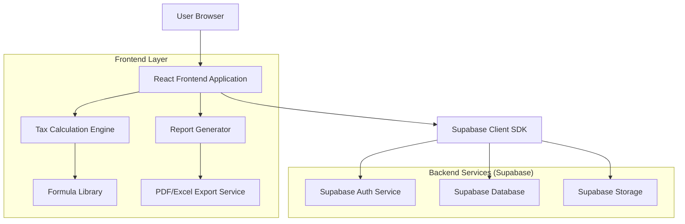
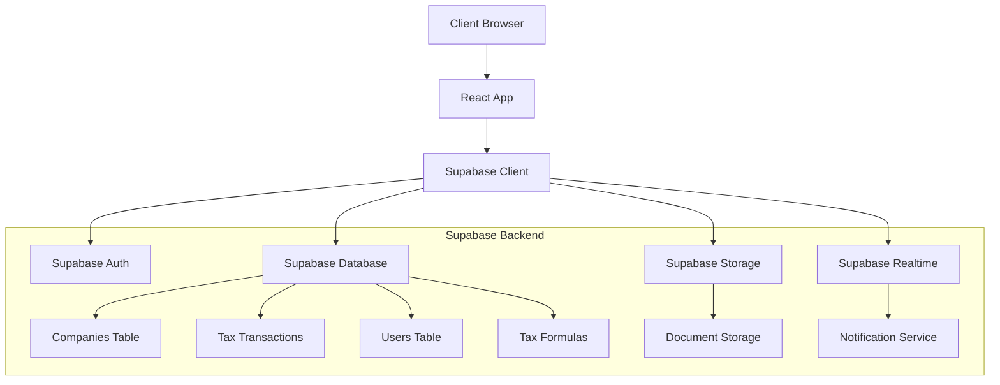
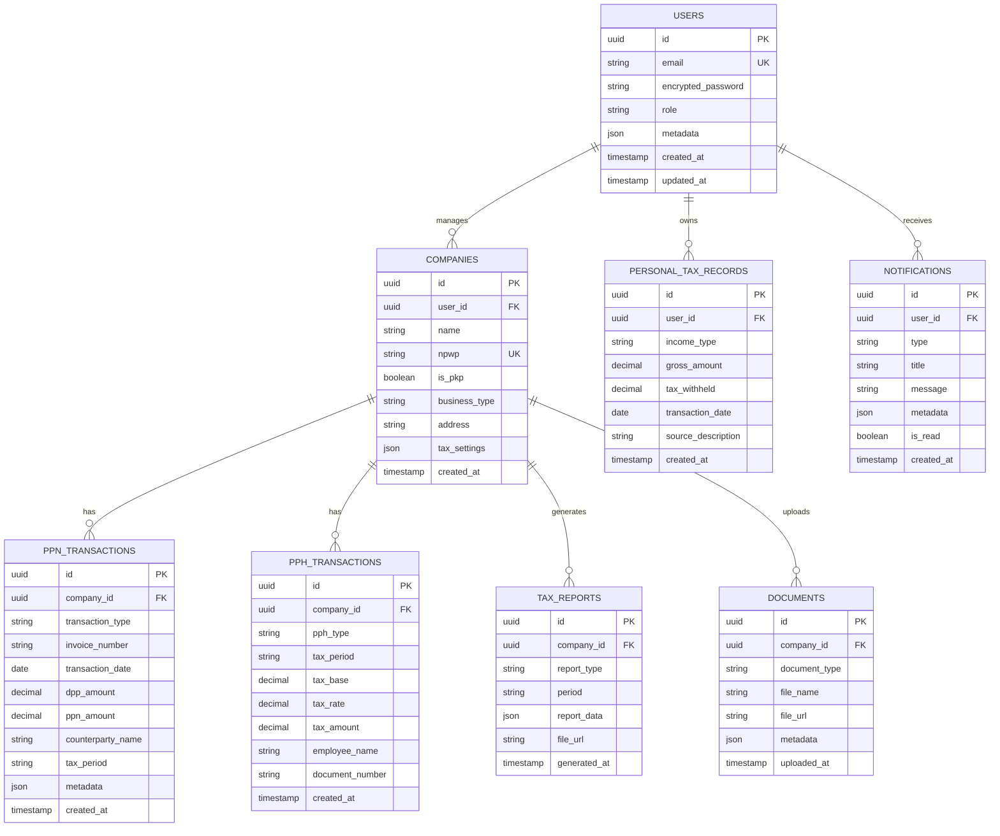

## 1. Architecture design



## 2. Technology Description
- **Frontend**: React@18 + TypeScript + Vite
- **UI Framework**: TailwindCSS@3 + HeadlessUI
- **State Management**: React Context + useReducer
- **Database**: Supabase (PostgreSQL)
- **Authentication**: Supabase Auth (JWT-based)
- **File Storage**: Supabase Storage
- **Initialization Tool**: vite-init
- **Additional Libraries**:
  - react-hook-form: Form handling and validation
  - recharts: Data visualization and charts
  - date-fns: Date manipulation
  - jspdf + xlsx: Export functionality
  - react-query: Data fetching and caching

## 3. Route definitions
| Route | Purpose |
|-------|---------|
| / | Login page, user authentication |
| /dashboard | Main dashboard, tax overview and summary |
| /companies | Company management, list and add companies |
| /companies/:id | Company detail and tax configuration |
| /personal-tax | Personal tax management for individual taxpayers |
| /tax-recording | Tax recording hub with PPN, PPh tabs |
| /tax-recording/ppn | PPN recording (input/output tax) |
| /tax-recording/pph-corporate | Corporate PPh recording (21/22/23/25) |
| /tax-recording/pph-personal | Personal PPh recording |
| /tax-formulas | Tax formula library and documentation |
| /tax-planner | Tax planning and simulation tools |
| /reports | Report generation and export |
| /settings | System settings and user management |
| /notifications | Tax deadline notifications and reminders |

## 4. API definitions

### 4.1 Authentication APIs
```
POST /auth/v1/token
```
Request:
```json
{
  "email": "user@example.com",
  "password": "securepassword"
}
```

Response:
```json
{
  "access_token": "eyJhbGc...",
  "token_type": "bearer",
  "expires_in": 3600,
  "refresh_token": "def50200...",
  "user": {
    "id": "user-uuid",
    "email": "user@example.com",
    "role": "admin"
  }
}
```

### 4.2 Company Management APIs
```
GET /rest/v1/companies
```
Response:
```json
[
  {
    "id": "company-uuid",
    "name": "PT Example",
    "npwp": "01.234.567.8-901.234",
    "is_pkp": true,
    "business_type": "Jasa Konsultansi",
    "created_at": "2024-01-01T00:00:00Z"
  }
]
```

```
POST /rest/v1/companies
```
Request:
```json
{
  "name": "PT New Company",
  "npwp": "98.765.432.1-098.765",
  "is_pkp": true,
  "business_type": "Perdagangan",
  "address": "Jl. Example No. 123"
}
```

### 4.3 Tax Recording APIs
```
POST /rest/v1/ppn_transactions
```
Request:
```json
{
  "company_id": "company-uuid",
  "transaction_type": "input", // or "output"
  "invoice_number": "INV-2024-001",
  "transaction_date": "2024-01-15",
  "dpp_amount": 10000000,
  "ppn_amount": 1100000,
  "counterparty_name": "PT Supplier",
  "tax_period": "2024-01"
}
```

```
GET /rest/v1/ppn_summary
```
Response:
```json
{
  "total_input_tax": 5500000,
  "total_output_tax": 11000000,
  "tax_payable": 5500000,
  "period": "2024-01"
}
```

### 4.4 Tax Calculation APIs
```
POST /rest/v1/calculate-tax
```
Request:
```json
{
  "tax_type": "pph21",
  "gross_income": 15000000,
  "marital_status": "K/2",
  "months": 12
}
```

Response:
```json
{
  "taxable_income": 120000000,
  "tax_liability": 15000000,
  "effective_rate": 0.125,
  "calculation_steps": [
    {
      "step": "Gross Income",
      "amount": 15000000
    },
    {
      "step": "Employment Expense (5%)",
      "amount": -500000
    }
  ]
}
```

## 5. Server architecture diagram


## 6. Data model

### 6.1 Database Schema


### 6.2 Data Definition Language

```sql
-- Users table
CREATE TABLE users (
    id UUID PRIMARY KEY DEFAULT gen_random_uuid(),
    email VARCHAR(255) UNIQUE NOT NULL,
    encrypted_password VARCHAR(255) NOT NULL,
    role VARCHAR(50) DEFAULT 'user' CHECK (role IN ('admin', 'finance', 'auditor', 'individual')),
    metadata JSONB DEFAULT '{}',
    created_at TIMESTAMP WITH TIME ZONE DEFAULT NOW(),
    updated_at TIMESTAMP WITH TIME ZONE DEFAULT NOW()
);

-- Companies table
CREATE TABLE companies (
    id UUID PRIMARY KEY DEFAULT gen_random_uuid(),
    user_id UUID REFERENCES users(id) ON DELETE CASCADE,
    name VARCHAR(255) NOT NULL,
    npwp VARCHAR(50) UNIQUE NOT NULL,
    is_pkp BOOLEAN DEFAULT false,
    business_type VARCHAR(100),
    address TEXT,
    tax_settings JSONB DEFAULT '{}',
    created_at TIMESTAMP WITH TIME ZONE DEFAULT NOW(),
    updated_at TIMESTAMP WITH TIME ZONE DEFAULT NOW()
);

-- PPN Transactions
CREATE TABLE ppn_transactions (
    id UUID PRIMARY KEY DEFAULT gen_random_uuid(),
    company_id UUID REFERENCES companies(id) ON DELETE CASCADE,
    transaction_type VARCHAR(20) CHECK (transaction_type IN ('input', 'output')),
    invoice_number VARCHAR(100) NOT NULL,
    transaction_date DATE NOT NULL,
    dpp_amount DECIMAL(15,2) NOT NULL,
    ppn_amount DECIMAL(15,2) NOT NULL,
    counterparty_name VARCHAR(255),
    tax_period VARCHAR(7) NOT NULL, -- Format: YYYY-MM
    metadata JSONB DEFAULT '{}',
    created_at TIMESTAMP WITH TIME ZONE DEFAULT NOW()
);

-- PPh Transactions
CREATE TABLE pph_transactions (
    id UUID PRIMARY KEY DEFAULT gen_random_uuid(),
    company_id UUID REFERENCES companies(id) ON DELETE CASCADE,
    pph_type VARCHAR(20) CHECK (pph_type IN ('21', '22', '23', '25', 'final')),
    tax_period VARCHAR(7) NOT NULL,
    tax_base DECIMAL(15,2) NOT NULL,
    tax_rate DECIMAL(5,2) NOT NULL,
    tax_amount DECIMAL(15,2) NOT NULL,
    employee_name VARCHAR(255),
    document_number VARCHAR(100),
    created_at TIMESTAMP WITH TIME ZONE DEFAULT NOW()
);

-- Personal Tax Records
CREATE TABLE personal_tax_records (
    id UUID PRIMARY KEY DEFAULT gen_random_uuid(),
    user_id UUID REFERENCES users(id) ON DELETE CASCADE,
    income_type VARCHAR(50) CHECK (income_type IN ('salary', 'dividend', 'fee', 'other')),
    gross_amount DECIMAL(15,2) NOT NULL,
    tax_withheld DECIMAL(15,2) DEFAULT 0,
    transaction_date DATE NOT NULL,
    source_description VARCHAR(255),
    created_at TIMESTAMP WITH TIME ZONE DEFAULT NOW()
);

-- Tax Reports
CREATE TABLE tax_reports (
    id UUID PRIMARY KEY DEFAULT gen_random_uuid(),
    company_id UUID REFERENCES companies(id) ON DELETE CASCADE,
    report_type VARCHAR(50) NOT NULL,
    period VARCHAR(7) NOT NULL,
    report_data JSONB NOT NULL,
    file_url VARCHAR(500),
    generated_at TIMESTAMP WITH TIME ZONE DEFAULT NOW()
);

-- Notifications
CREATE TABLE notifications (
    id UUID PRIMARY KEY DEFAULT gen_random_uuid(),
    user_id UUID REFERENCES users(id) ON DELETE CASCADE,
    type VARCHAR(50) NOT NULL,
    title VARCHAR(255) NOT NULL,
    message TEXT NOT NULL,
    metadata JSONB DEFAULT '{}',
    is_read BOOLEAN DEFAULT false,
    created_at TIMESTAMP WITH TIME ZONE DEFAULT NOW()
);

-- Documents
CREATE TABLE documents (
    id UUID PRIMARY KEY DEFAULT gen_random_uuid(),
    company_id UUID REFERENCES companies(id) ON DELETE CASCADE,
    document_type VARCHAR(50) NOT NULL,
    file_name VARCHAR(255) NOT NULL,
    file_url VARCHAR(500) NOT NULL,
    metadata JSONB DEFAULT '{}',
    uploaded_at TIMESTAMP WITH TIME ZONE DEFAULT NOW()
);

-- Indexes for performance
CREATE INDEX idx_companies_user_id ON companies(user_id);
CREATE INDEX idx_companies_npwp ON companies(npwp);
CREATE INDEX idx_ppn_transactions_company_id ON ppn_transactions(company_id);
CREATE INDEX idx_ppn_transactions_period ON ppn_transactions(tax_period);
CREATE INDEX idx_pph_transactions_company_id ON pph_transactions(company_id);
CREATE INDEX idx_pph_transactions_period ON pph_transactions(tax_period);
CREATE INDEX idx_personal_tax_user_id ON personal_tax_records(user_id);
CREATE INDEX idx_notifications_user_id ON notifications(user_id);
CREATE INDEX idx_documents_company_id ON documents(company_id);

-- Row Level Security (RLS) Policies
ALTER TABLE companies ENABLE ROW LEVEL SECURITY;
ALTER TABLE ppn_transactions ENABLE ROW LEVEL SECURITY;
ALTER TABLE pph_transactions ENABLE ROW LEVEL SECURITY;
ALTER TABLE personal_tax_records ENABLE ROW LEVEL SECURITY;
ALTER TABLE tax_reports ENABLE ROW LEVEL SECURITY;
ALTER TABLE notifications ENABLE ROW LEVEL SECURITY;
ALTER TABLE documents ENABLE ROW LEVEL SECURITY;

-- RLS Policies
CREATE POLICY "Users can view their own companies" ON companies
    FOR SELECT USING (auth.uid() = user_id);

CREATE POLICY "Users can manage their own companies" ON companies
    FOR ALL USING (auth.uid() = user_id);

CREATE POLICY "Users can view their company transactions" ON ppn_transactions
    FOR SELECT USING (company_id IN (SELECT id FROM companies WHERE user_id = auth.uid()));

CREATE POLICY "Users can manage their company transactions" ON ppn_transactions
    FOR ALL USING (company_id IN (SELECT id FROM companies WHERE user_id = auth.uid()));

CREATE POLICY "Users can view their personal tax records" ON personal_tax_records
    FOR SELECT USING (auth.uid() = user_id);

CREATE POLICY "Users can manage their personal tax records" ON personal_tax_records
    FOR ALL USING (auth.uid() = user_id);

-- Grant permissions
GRANT ALL ON ALL TABLES IN SCHEMA public TO authenticated;
GRANT SELECT ON companies TO anon;
GRANT SELECT ON ppn_transactions TO anon;
GRANT SELECT ON pph_transactions TO anon;